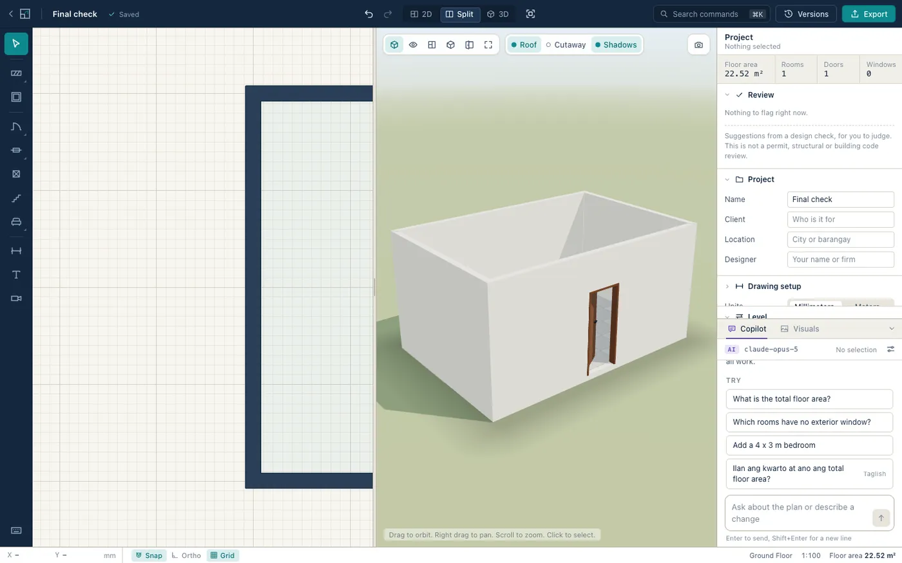
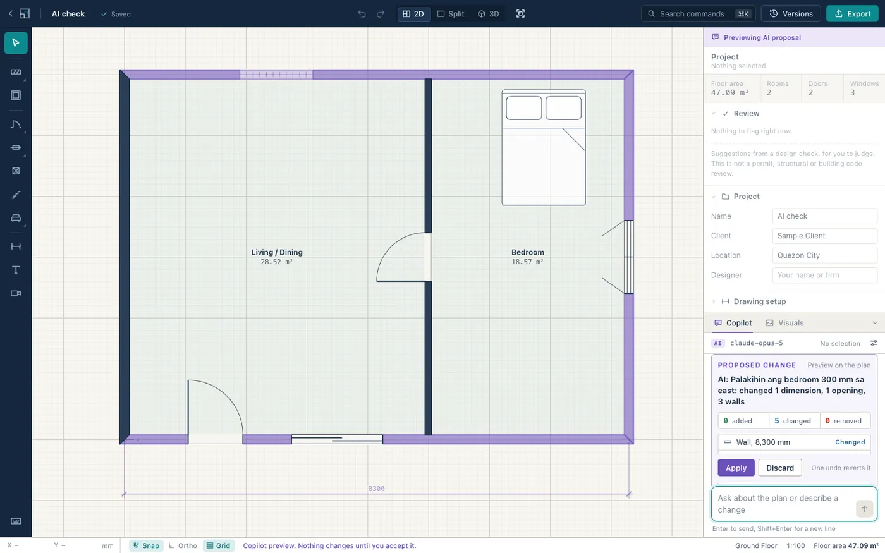
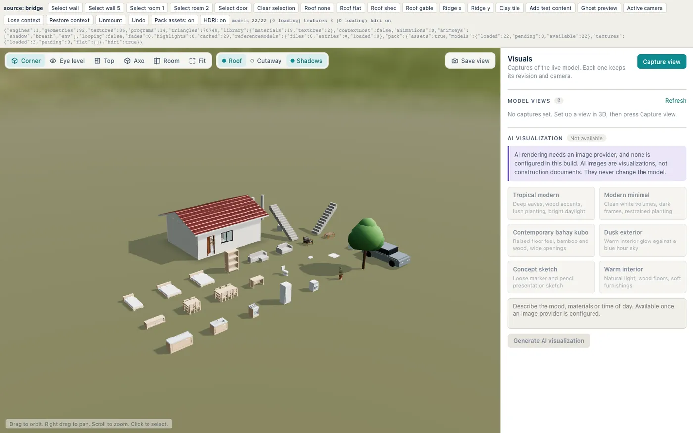
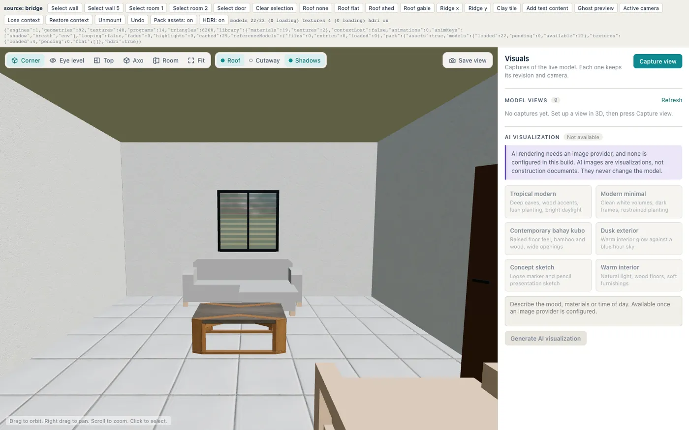
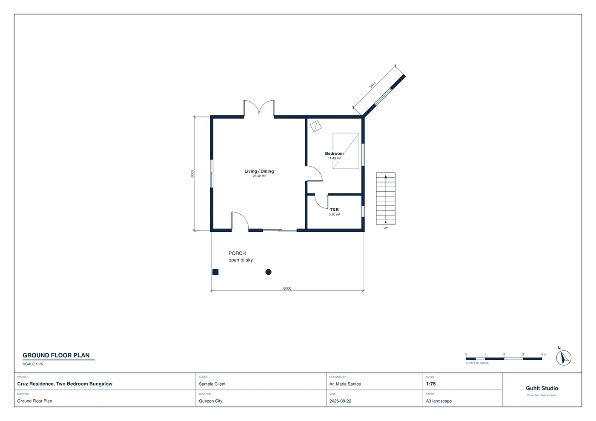

<p align="center">
  
</p>

<h1 align="center">Guhit Studio</h1>

<p align="center">
  Draw a real floor plan in minutes, see it in 3D instantly, ask AI to make revisions, and hand off to AutoCAD, SketchUp or a BIM tool.<br>
  A PH-first architectural design desktop app for macOS and Windows.
</p>

<p align="center">
  <a href="https://github.com/techuila/guhit-studio/actions/workflows/build.yml"></a>
  <a href="https://github.com/techuila/guhit-studio/releases/latest"></a>
</p>

<p align="center">
  
</p>

## What it does

| | |
|---|---|
| **Semantic 2D drafting** | Walls, doors, windows, rooms, columns, stairs, furniture, dimensions and notes. Rooms find themselves and show their net area live. Type an exact length while drawing. Snapping, ortho, grids, marquee selection, undo for everything. |
| **Live 3D** | The same model extruded as you draw: real openings, roof presets (flat, shed, gable), CC0 materials and furniture, HDRI sky, cutaway, camera presets, captures tied to the model revision. |
| **AI copilot** | Say "palakihin ang bedroom 300 mm sa east" and get a preview of the exact change. Nothing is committed until you approve; one undo reverts it. Answers about areas and counts come from the model, never from guesses. Select part of the plan and switch on **Only the selection**: the engine then refuses any AI change outside it. |
| **Claude Code, Codex, Cursor** | The app is an MCP server. Drive it from your own AI subscription with `claude mcp add --transport http guhit http://localhost:1450/mcp`: draw plans, save views, capture and path trace renders, make AI visualizations, and change only what you selected in the window. See [docs/MCP.md](docs/MCP.md). |
| **Live sessions** | Work on one plan together from several computers: on the same network or VPN, or over the internet through a small relay that only forwards encrypted bytes. Everyone's pointer shows in their own color with their name, press **/** to chat right at your pointer, and the Chat panel keeps the history. The project and its undo history stay on the host's computer; the others join with an invite. |
| **AI visualization** | Turn a model capture into a photorealistic image with a style preset, then drag a slider to compare it with the model view. Always labelled, never written back into the model. |
| **Interoperability** | Export PDF and SVG sheets, DXF 2D and 3D, IFC4, glTF, OBJ, DAE, DWG (through the ODA File Converter) and `.guhit` bundles. Import DXF and DWG as recognized walls or linework, and glTF or OBJ as reference models. See [docs/INTEROP.md](docs/INTEROP.md). |
| **Local first** | Projects are files on your computer. Versions, autosave, thumbnails. No account. |
| **Plumbing and walkthrough** | Draw cold water, hot water, drainage and vent runs (P), each on its own layer. See them in 3D, switch the building to X-ray (X) and walk through the house at eye height (Shift+W). Review items flag pipes through columns or door openings, crossing pipes, drains without enough fall, and every sleeve or flashing. A take-off counts lengths by size, elbows, tees and sleeves, and pipes go into PDF, DXF and IFC. Guhit coordinates pipes; sizing stays with a registered Master Plumber. |
| **Philippine defaults** | Millimeters, 150 mm CHB walls, tropical roof presets, local material presets, Taglish copilot. |

<p align="center">
  
  
</p>
<p align="center">
  
  
</p>

## Install

Download from the website: **[techuila.github.io/guhit-studio](https://techuila.github.io/guhit-studio/#download)**. The buttons start the download of the latest release directly:

| System | File |
|---|---|
| Mac with Apple silicon | [Guhit-Studio-mac-apple-silicon.dmg](https://github.com/techuila/guhit-studio/releases/latest/download/Guhit-Studio-mac-apple-silicon.dmg) |
| Mac with an Intel chip | [Guhit-Studio-mac-intel.dmg](https://github.com/techuila/guhit-studio/releases/latest/download/Guhit-Studio-mac-intel.dmg) |
| Windows 10 or 11 | [Guhit-Studio-windows-setup.exe](https://github.com/techuila/guhit-studio/releases/latest/download/Guhit-Studio-windows-setup.exe) |

The builds are not code signed yet, so the computer asks once before opening the app:

- **macOS 15 or newer:** open the app, click Done when macOS says it cannot verify it, then go to System Settings, Privacy & Security, and click Open Anyway.
- **macOS 14 or older:** right-click the app in Applications and choose Open.
- **Windows:** when SmartScreen says it protected your PC, click More info, then Run anyway.

Requirements: macOS 12 or newer, Windows 10 or newer.

## First five minutes

1. Open the app, create a project from the **Sample bungalow** template, or from **Bungalow with plumbing** to see pipes, X-ray and walk mode.
2. Press **W** and click to draw walls; type `4000` then Enter for an exact length. Close the shape and the room appears with its area.
3. Press **D** or **N** to hang a door or window on a wall. **F** flips the swing while placing.
4. Press **2** for plan and 3D side by side, **3** for 3D only. Drag to orbit.
5. Open the copilot dock and ask for a change. Review the ghost preview, then **Apply**.
6. **Export** for a PDF sheet, or a DXF for AutoCAD, or IFC for a BIM tool.

All shortcuts: [docs/SHORTCUTS.md](docs/SHORTCUTS.md), or press `?` in the app.

### AI features and keys

| Feature | What it needs | Where the key lives |
|---|---|---|
| In-app copilot | A Claude API key from [platform.claude.com](https://platform.claude.com) (`sk-ant-api...`). About 3 to 7 cents per turn. | Copilot settings. Stored in the app's data folder, readable only by your user, never in a project. |
| Claude Code, Codex, Cursor driving the app | Your existing subscription, inside that tool. No key in Guhit. | Nowhere. See [docs/MCP.md](docs/MCP.md). |
| AI visualization | A Google AI Studio key (`AIza...`). About $0.05 to $0.24 per image. | Settings, AI rendering. |

Drawing, 3D and every export work without any key. Claude and ChatGPT consumer subscription tokens are not API keys and will not work in the copilot; use them through the MCP route instead.

## Build from source

Prerequisites: Rust stable (1.87 or newer), Node 22 or newer, pnpm 11, and the [Tauri 2 prerequisites](https://v2.tauri.app/start/prerequisites/) for your platform (Xcode Command Line Tools on macOS, the Visual Studio C++ build tools and WebView2 on Windows).

```bash
git clone https://github.com/techuila/guhit-studio.git
cd guhit-studio
pnpm install
pnpm tauri dev
```

Build installers with `pnpm tauri build`. Rebuild the CC0 asset pack (not needed for normal work) with `node scripts/assets-build.mjs`.

### Run the whole app in a browser

The Rust engine also serves a small HTTP bridge, so the full UI runs in a normal browser for development and automated checks, with no desktop shell:

```bash
pnpm bridge   # terminal 1: the Rust backend on :1430
pnpm dev      # terminal 2: the UI on :1420
```

## How it is built

```
crates/guhit-model     contract types: model, commands, derived data, IPC payloads (generates the TS bindings)
crates/guhit-core      the engine: commands, undo, wall joins, rooms, review checks, queries (no I/O)
crates/guhit-export    PDF, SVG, DXF 2D and 3D, IFC4
crates/guhit-import    DXF parsing and wall recognition
crates/guhit-app       application service: projects, versions, exports, imports, copilot, AI renders
crates/guhit-mcp       the MCP server over the same service
crates/guhit-devbridge dev-only HTTP transport
crates/guhit-relay     the relay that carries live sessions over the internet (docs/RELAY.md)
src-tauri              the desktop shell: one IPC command, the MCP endpoint, auto-update
src/                   React UI: 2D editor (canvas), 3D viewer (three.js), shell, copilot
site/                  the landing page, published with GitHub Pages
```

Two rules hold everything together. The Rust engine is the only authority over the model: the UI keeps a read-only mirror and sends typed commands, and the AI uses the same commands. And every command is deterministic, validated, and one undo step, so a preview always equals the commit.

Further reading: [AGENTS.md](AGENTS.md) (repo map, constraints, how to verify), [DECISIONS.md](DECISIONS.md) (locked decisions and why), [docs/CONTRACT.md](docs/CONTRACT.md) (types, IPC, conventions), [docs/MOTION.md](docs/MOTION.md) (the motion system).

## Contributing

Issues and pull requests are welcome. Please read [AGENTS.md](AGENTS.md) and [DECISIONS.md](DECISIONS.md) first: they say what is locked and what is open.

**Before you open a pull request**

```bash
cargo test --workspace --exclude guhit-studio   # engine, export, import, app, mcp
cargo build -p guhit-studio                     # the desktop shell compiles
pnpm gen:types                                  # after any change in crates/guhit-model
pnpm typecheck && pnpm build && pnpm vitest run # frontend
```

The 2D editor and 3D viewer also have scripted browser checks under `src/editor2d/dev/checks/` and `.devdata/` step files; `node scripts/ui-check.mjs` drives them. CI runs the tests and builds the app on macOS and Windows for every push and pull request.

**Conventions**

- Commits: `type(scope): subject`, lowercase, imperative, under 72 characters. Types: feat, fix, refactor, perf, chore, docs, test, style, build, ci. No body unless the change is not obvious.
- Lengths are millimeters, plan +x is east and +y is north, angles are degrees counter-clockwise. See the conventions in [docs/CONTRACT.md](docs/CONTRACT.md).
- Contract files (`crates/guhit-model`, `src/contract`, `src/state`, the design tokens) change only with a reason and with every consumer updated in the same change.
- UI changes follow [docs/MOTION.md](docs/MOTION.md): every interaction animates, drags track the pointer, `prefers-reduced-motion` is respected, no animation library.
- Plain language in code, comments and UI copy. No em dashes or en dashes; use a hyphen.
- Third-party assets must be CC0 and listed in [assets/ASSETS.md](assets/ASSETS.md).

**Good first contributions**: a new catalog object (2D symbol plus 3D form plus a CC0 model), a material preset, a review check, a DXF fixture from a real drawing that the wall recognizer gets wrong, translations of UI copy.

**Releases** are cut by the maintainers with a tag push; see [docs/RELEASING.md](docs/RELEASING.md).

## Security

Keys for the copilot and AI rendering are stored in the app's data folder with user-only permissions and never leave your machine except in requests to the provider you chose. The MCP endpoint and the dev bridge listen on localhost only and refuse other origins. A live session is TLS 1.3 from guest to host, pinned to the certificate named in the invite, so the relay can neither read nor change it; the relay stores nothing and has no accounts. Report a vulnerability privately through GitHub's security advisories on this repository rather than a public issue.

## License

Not decided yet. Until a license file is added, the code is copyright the authors and all rights are reserved; you may read and build it, and contributions are accepted under the license the project settles on. The bundled assets are CC0 (see [assets/ASSETS.md](assets/ASSETS.md)).

## Acknowledgements

Built with [Tauri](https://tauri.app), [three.js](https://threejs.org), React and Rust. Assets from [Poly Haven](https://polyhaven.com), [Kenney](https://kenney.nl) and [ambientCG](https://ambientcg.com), all CC0. Made in the Philippines.
